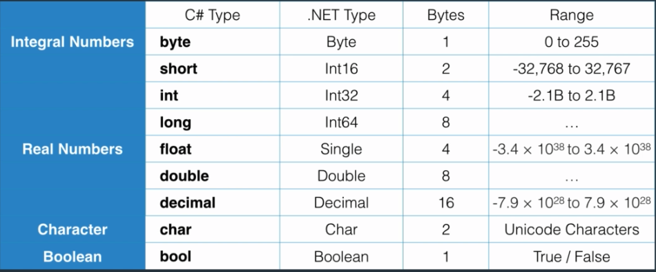

# Naming Conventions

For local variables: Camel Case -> int numberHouses;
For constants: Pascal Case -> const int MaxZoom = 5;

Instead of explicitly defining the data type we can use the keyword `var` then the compliler defines the data type automatically.

# Primitive values



int16 -> short (2 bytes -> 2*8 = 16)
int32 -> int (4 bytes -> 4*8 = 32)
int64 -> long (6 bytes -> (6*8 = 64)

Real Numbers

The default C# type for real numbers is `double`, so when defining float of decimal nombers we need to specify it in the value as well if not the compilation will fails to assign a double into a float/decimal

```
float number = 1.2f;
decimal number = 1.2m;
```

## Overflowing

When you exceeds the boundaries of the bytes' Data type. In C# we do not have overflowing default validations.

```
byte number = 255; //it's the max
number = number + 1; // Result: 0
```

We can use `checked` keyword to validate overflowing at runtime. It will raise an axception when it occours.

```
checked
{
    byte number = 255;
    number = number + 1;
}
```

## Type conversion

### Implicit Type Conversion

Data type of lower size can be assigned into another data type of greater size (no data loss) and the compiler completes the missing bytes with 0s. 

```
byte n = 5;
int n1 = n;
```

### Explicit type conversion

When a Data type of greater size is assigned to another of lower size, there's a chance of data loss, in which case the code won't compile. 

But if the value assigned into the bigger type is not using all the bytes and only someones that do not exceed the size of the lower data type, then this conversion is allowed.

When there's a chance of data loss, you need explicitly let the compliler know that we want to cast/convert the data eventhoug there's a data loss by prefixing the variable.

```
int 1 = 1;
byte b = (byte)i;
```

### Non-compatible types

When you want to convert a string into an interger for example. In this cases the code won't complite.

It's required to use `Convert` class or `Parse` method.

```
string s = 1;
int i = Convert.ToInt32(s);
int j = int.Parse(s);
```

# Non-Primitive Types

## Classes

Classes: Consists on an `access modifier` `class` keyword and  `identifier`.

`new` keyword must be used when creating a instance of a class in order to allocate memory reuqired for that object.

Arrays and Strings are built-in classes.

### Static modifier

It allows to access a method/attribute directly from the Class without the need of creating a instance of the class. In fact we cannot access `static` methods from objects.

When we use `static` that method/attribute will be allocated in only 1 location in the memory, which will be with the class, then each time we create an object we are not allocated memory for that method all the times. 

Without static 

Obj1                Obj2            Obj3
Add()               Add()           Add()

With static method

Obj1                Obj2            Obj3

                ClassObj
                Add()

Use `static` modifier when you want to present a concept that only a single instance of that should exist in memory. For example static void Main()

## Structs

It is similar to classes, it groups attributes and methods together. It is used to define small, lightweight objects.

Use keyword `struct` instead of `class`, the rest is the same.
primitive types are all structures.

## Arrays

A data structure to store a collection of variables of the same tyoe. Arrays have a fix sized that must be defined and cannot be changed.

Une the `new` keyword to allocate memory for it.

```
// empty array.
// All the elements are set to defualt value of the data type of the array.
int[] numbers = new int[3];
number[0] = 3;
number[1] = 4;
number[2] = 5;

// assigning values
int[] numbers = new int[3] {1, 2, 3};
```

Arrays can be single or multi dimension. 
There are 2 types multi demension arrays: Rectangular and Jagged (the number of columns can be different) another way to see it is like an array of arrays.

```
// Rectangular arrays
var matrix = new int[3, 2];
var matrix1 = new int[2, 3]
{
    {1, 3, 5},
    {6, 2, 12}
};
var element = matrix1[0, 0];
var matrix_3d = new int[3, 2, 4]; 

// Jagged arrays
var array = new int[3][];

array[0] = new int[4];
array[1] = new int[5];
array[2] = new int[3];

array[0][1] = 1; 

// mehtods
matrix.Lenght
var index = Array.IndexOf(numbers, 3)
Array.Clear(numbers, 0, 2) // Set items to 0/false
Array.copy()
```

## List

It's similar to arrays tha twe can store elemets of the same type but it has dynamic size.

List is a generic type and it's indicated by the <> symbols

Useful methods
* Add() to add an object ot the list
* AddRange() to add a list of objects
* Remove() to remove 1 object fromt eh list
* RemoveAt() removes the object at given index
* IndexOf() returns the index of a given object
* Contains() tells if the list contains given object or not
* Count returns the number of object in the list

```
var numbers = new List<int>();
var numbers = new List<int>() {1, 2, 3 4, 5};
```

## Strings

A sequence of characters surrounded with double quotes ("") whiler character are surrounded with single quotes (''). Strings are inmutable.

```
// String concatenation
string name = firstName + " " + lastName;

// String format using static Format method from string class
string name = string.Format("{0} {1}". firstName, lastName);

// Using Join
int[] numbers = new int[3] {1, 2, 3};
string list = string.Join(",", numbers);

// Using String class
using System;
String name = "Jonh";
```

Escape characters

\n -> new line
\t -> Tab
\\ -> Backslash
\' -> single quotation mark
\" -> double quotation mark

### Verbatim Strings

Instead of using escape characters (\\ for example in Windows paths) we can use `@` before the string and write the string without escape chars.

```
string path = "Use this path\nc:\\projects\\pro1\\folder"
string path = @"Use this path
c:\projects\pro1\folder"
```

### StringBuilder

As `Strings` are inmutable, we can use `StringBuilder` to create mutable **strings** and easy manipulation. Missing Search methods and only manipulation methods available.

It is under System.Text namespace.

## Enums

A set of name/value pairs (constants). Used when you have a set of constants. By default Enum uses `int` data types but you can specify `byte` if needed.

The values can be accessed through the `key` using the dot notation

```
// If values are not set, by default it starts from 0
public enum shppiingMethod : byte
{
    Regular = 1;
    Express = 2;
}

var method = shippingMethod.Express;

//Casting to enum
var methodId = 2;
Console.WriteLine((shippingMethod)methodId);
//Output: Express
```

## Reference Types and Value Types

Value Types: Structures
* Allocated on stack memory
* Memory allocation done automatically
* Immediately removed when out of scope
* ex: 
```
var a = 10; var b = a; b++; 
//a and b values stored in diferrent locations in MEM
```

Reference Types: Classes
* You need to allocate memory (usgin `new` keyword)
* Memory allocated on heap
* Garbage collected by CLR
* ex:
```
var arr1 = int[3] {1, 2, 3}
var arr2 = arr1
arr2[0] = 0
// Element 0 for both arrays is 0 b/c they share the same MEM loc
```

## DateTime

DateTime objects are immutable, which means once they're set, they cannot be changed.

## Files

Uses the System.IO namespace.

File (provides *static* methods), FileInfo (provides *instance* methods)
* Provide mehtods for creating, copying, deleting, moving, and opening of files.


# Procedural Programming

A programming paradigm based on procedure/function/methods calls.

# Object Oriented Programming

A programming paradigm based on objects.

